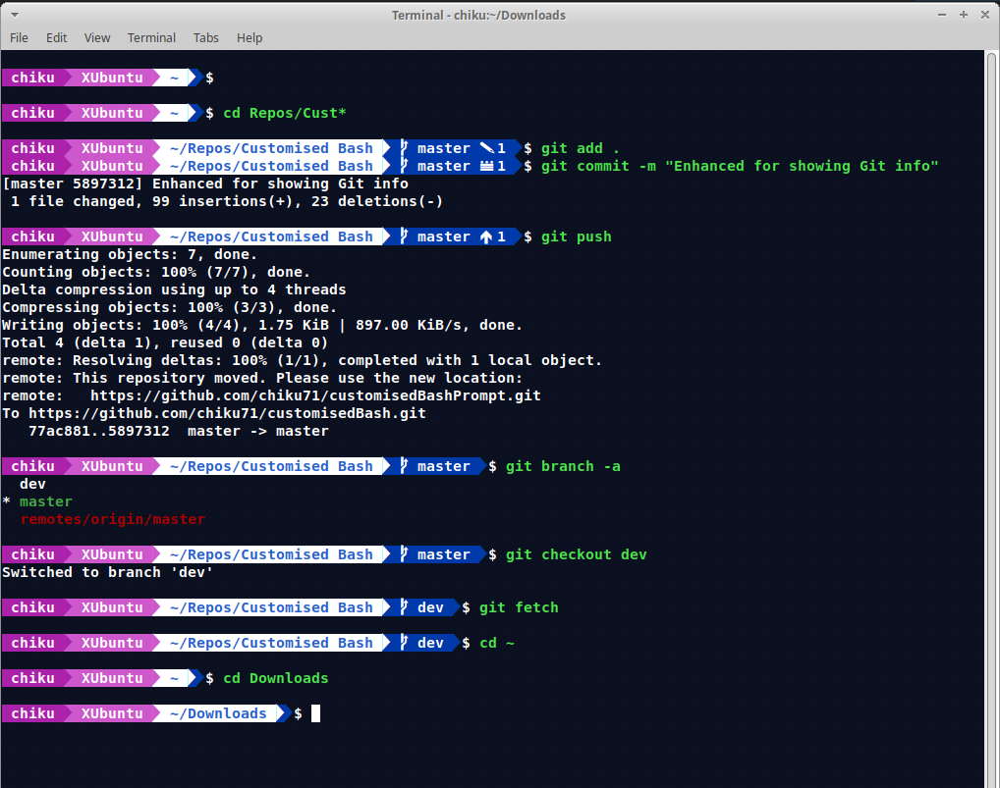
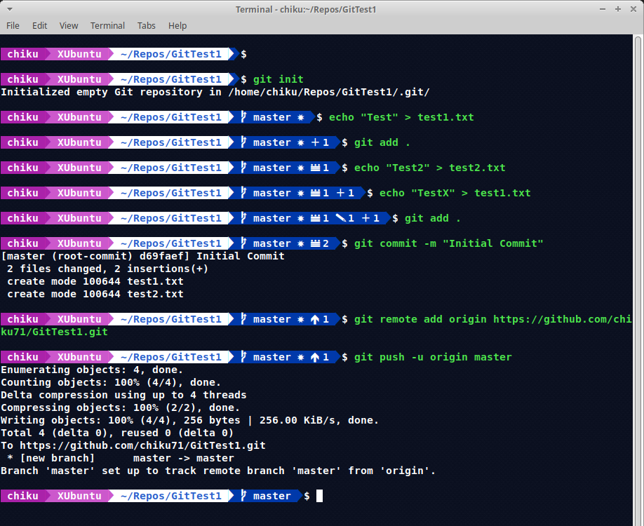

# GitFeaturedTerminalPrompt

## Dependencies:  
   i) fonts-powerline  
      ==> sudo apt-get install fonts-powerline  
      
      
## Git Status Info:
   1)  : Directory has a Git Repo and the Git Branch name 
   2)  : Local branch, not available in remote 
   2)  : Number of commits behind  
   3)  : Number of commits ahead  
   4)  : Number of files staged  
   5)  : Number of files modified but unstaged  
   6)  : Number of files untracked or newly added
   7)  : Number of conflicts  
   8)  : Number of stash  
   
   
## Sample Screens:  

